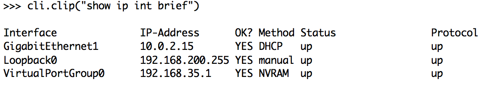
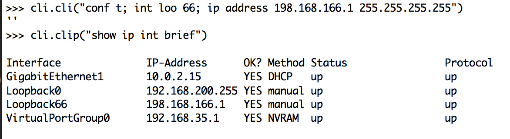
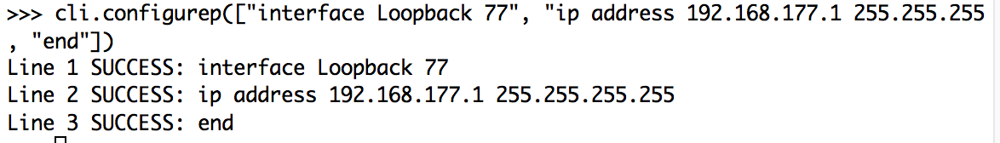
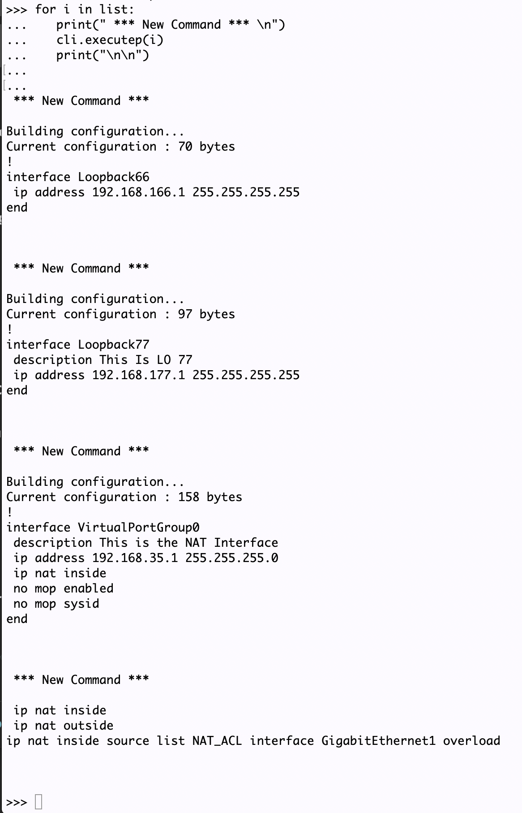

## DevNet 2556 - Python on IOS-XE

### TABLE OF CONTENTS
* Module 1 - [Verifying Guest Shell Operation](Module1.md)
* Module 2 - [Interactive Python Prompt](Module2.md)
* Module 3 - [Python API](Module3.md)
* Module 4 - [Python Script](Module4.md)
* Module 5 - [Embedded Event Manager](Module5.md)
* Module 6 - [NETCONF & YANG](Module6.md)
* Module 7 - [A Deeper Look at NETCONF](Module7.md)
* Module 8 - [Bringing It All Together](Module8.md)


### Module 3 - Python API

A built-in module for the Python interpreter embedded in IOS-XE is a new Python API which permits Python calls to use CLI commands directly and return the results.  This allows users to leverge the power of Python with the experience of programming IOS through CLI.  

The following commands are available through the Python API:

**cli.cli(command)** - takes an IOS command or a delimited batch of commands as an argument (delimiter is a space and semicolon), runs through the IOS parser, and returns the result

**cli.clip(command)** - takes an IOS command or a delimited batch of commandsas an argument (delimiter is a space and semicolon), runs through the IOS parser, and prints the result

**cli.execute(command)** - executes a single exec command and returns the result

**cli.executep(command)** - executes a single exec command and prints the result

**cli.configure(command)** - configures the device with the command, multiple commands can be separated by newlines, and it returns the result

**cli.configurep(command)** - configures the device with the command, multiple commands can be separated by newlines, and it prints the result


--------------------------------
Let's test these out by starting with the `cli.cli()` command.  Copy the content in the grey box below:

```
import cli
cli.cli("show ip int brief")
```

You will see the output of a typical CLI command
```
'\nInterface              IP-Address      OK? Method Status                Protocol\nGigabitEthernet1       10.0.2.15       YES DHCP   up                    up      \nLoopback0              192.168.200.255 YES manual up                    up      \nVirtualPortGroup0      192.168.35.1    YES NVRAM  up                    up      \n'
```

However, notice the format is difficult to read.  Maybe it would be better to return it printed rather than as a simple return. Let's try using this one instead.

```
cli.clip("show ip int brief")
```

Now the output is cleaner!



Let's try some other commands.  Now we're going to add an interface to the device.  We could use the same `cli.cli()` command and then verify the result as a simple exercise.

Copy the content from the grey box below and paste that into the device.

```
cli.cli("conf t ; int Loopback 66 ; ip address 192.168.166.1 255.255.255.255 ; end")
cli.clip("show ip int brief")
```
We see the result, and notice that Loopback 66 has been added, but we needed a second command to verify the result.




While we can use the `cli.cli()` command to execute configurations like the one above, a better method is to use the `cli.configure()` command to do this.  This second command allows us to create a list of IOS commands that should be executed by entering them in order separated by carriage returns.  Additionally, if we use the `cli.configurep()` command, we can get immediate feedback as to if the list of commands worked and which ones were successful.

Let's see how we would do this.  We will start by creating a list of commands to create a new Loopback address.

Copy the content from the grey box below and paste that into the device.

```
configuration = '''interface Loopback 77
ip address 192.168.177.1 255.255.255.255
description This is LO 77
end'''
```
Once this set of commands is entered, copy the next gray box to execute the configuration using `configurep()`

```         
cli.configurep(configuration)
```
Now we see a result from each command in the list.



Let's explore the final cli command, `cli.execute()`.  This command is used to execute a single exec level command.  So it cannot be used to configure a device as there is no way to retain status in IOS-XE from one execute command to the next.  Thus, there is no way to enter "config t" mode and then execute successive commands.  

If we want to use the `cli.execute()` command to run through a series of commands, we can use a Python List with a for loop to get that done.  Let's take a look at how that would work.

First, we will create a list of the exec level commands we want to run.  Copy the information in the next gray box to get our list added.

```
list = ["show runn int loo 66", "show runn int loo 77", "show runn int Vir 0", "show runn | i nat"]
```

Once this list is in place, copy the next gray box to run our for loop.

```
for i in list:
   print(" *** New Command *** \n")
   cli.executep(i)
   print("\n\n")
   
```
####Make sure you hit one more carriage return un-indented to show the python interpreter you are finished with the for loop commands.

You should see output like the one below.




This demonstrates some simple uses of the Python API.  In the next section we will see how some of this can be used in a more programmatic fashion.

### [Next Step - Module 4 - Python Script](Module4.md)
