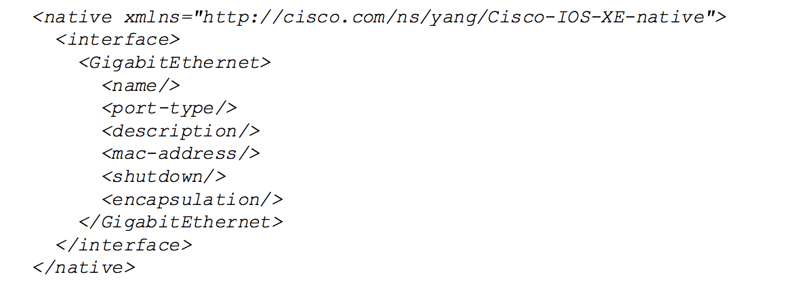

## DevNet 2556 - Python on IOS-XE

### TABLE OF CONTENTS
* Module 1 - [Verifying Guest Shell Operation](Module1.md)
* Module 2 - [Interactive Python Prompt](Module2.md)
* Module 3 - [Python API](Module3.md)
* Module 4 - [Python Script](Module4.md)
* Module 5 - [Embedded Event Manager](Module5.md)
* Module 6 - [NETCONF & YANG](Module6.md)
* Module 7 - [A Deeper Look at NETCONF](Module7.md)
* Module 8 - [Bringing It All Together](Module8.md)


### Module 6 - NETCONF & YANG

Outside of the Python API which we explored in Module 3, device configuration can also be completed using NETCONF.  This is an industry standard protocol for manipulating configurations on devices. In order to properly control devices with NETCONF, industry standard models, in YANG format, are used to provide the proper context and structure to manipulate the configurations.   

While YANG models are provided by industry standards organizations like the IETF, manufacturers can and do provide their own extensions to those models.  They might do this to enhance the capabilities of their equipment beyond what a standards organization will provide.

In order to use NETCONF on IOS-XE, the capabiliy must be enabled.  For this workshop, Netconf has already been enabled on the IOS-XE devices.  Copy the information in the grey box below and paste it into the device in order to confirm that it is indeed configured that way.

```
show running | include netconf-yang
```

<br/>
<br/>


For this module, we will be using a YANG model that Cisco built to expand upon the standard data structures of IETF models.  For this lab, we will be extracting the hostname of the device using the IOS-XE/Native Yang model.  

Let's take a look at some basic structuring of the Cisco-IOS-XE-Native YANG Model.



Here we see the information follows a well-defined structure.  In this example, we see a model that will gather information about a device's GigabitEthernet interfaces.  The information returned will be nested within the GigabitEthernet interface structure.  Here we see that some of the data pieces that will be returned include the name, port-type, description, mac-address, shutdown state, and encapsulation type.  


Let's take a look at using a basic YANG model to gather a basic piece of information from an IOS-XE device through a Python script.

The Python script used is `get_hostname.py` and is the following:

```python
#!/usr/bin/env python
#
from ncclient import manager
import sys
import xml.dom.minidom

# the variables below assume the user is leveraging a
# Vagrant Image running IOS-XE 16.6 or later on local device
HOST = '192.168.35.1'
# use the NETCONF port for your IOS-XE
PORT = 830
# use the user credentials for your IOS-XE
USER = 'vagrant'
PASS = 'vagrant'


def main():
    """
    Main method that retrieves the hostname from config via NETCONF.
    """
    with manager.connect(host=HOST, port=PORT, username=USER,
                         password=PASS, hostkey_verify=False,
                         device_params={'name': 'default'},
                         allow_agent=False, look_for_keys=False) as m:

        # XML filter to issue with the get operation
        hostname_filter = """
                        <filter>
                            <native xmlns="http://cisco.com/ns/yang/Cisco-IOS-XE-native">
                            </native>
                        </filter>
                        """

        result = m.get_config('running', hostname_filter)
        xml_doc = xml.dom.minidom.parseString(result.xml)
        hostname_obj = xml_doc.getElementsByTagName("hostname")
        hostname = hostname_obj[0].firstChild.nodeValue
        print(hostname)


if __name__ == '__main__':
    sys.exit(main())
```

While a more detailed description of NETCONF & YANG are outside of the scope of this lab, it is worth highlighting a few of the critical components of the Python script above.

1. ncclient is the NETCONF client model for Python.  Through this, various NETCONF calls can be made inside the script.  In this lab, we use the command `get_config('running', FILTER)` in order to collect information from the running config.
2. the `manager.connect` function shows how we will connect to the device.  Notice we use a defined username and password along with the IP address of the device and its NETCONF port, 830, to connect.
3. The `xml_filter` being used is `http://cisco.com/ns/yang/Cisco-IOS-XE-Native` and this is a YANG model that will provide the information we need in a standard model.  
4. We use miniDOM to parse the data collected from the `get_config` command.  Here, we are specifically looking for an element with a Tag Name called "hostname."

Copy the commands inside the grey box below and paste them into the device prompt, and we will use the script to retrieve the hostname of the device.

```
guestshell run python /flash/get_hostname.py
```
This ends up being a very simple return, but we can see the power of using a more standardized structure to categorize data in a device's configuration.


For the next module, let's take another look at how we can identify and categorize returned data in a more meaningful way.  


### [Next Step - Module 7 - A Deeper Look at NETCONF](Module7.md)


