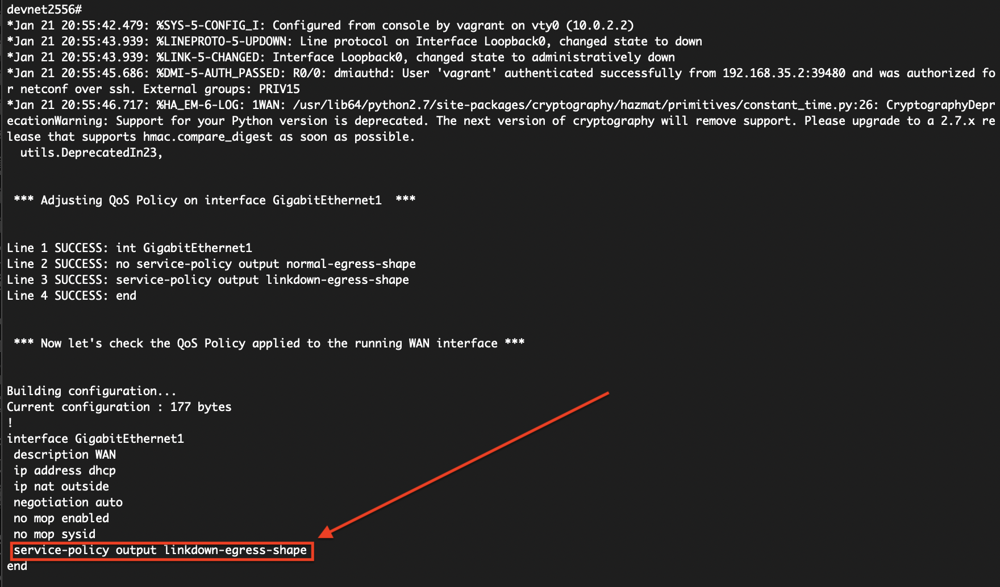

## DevNet 2556 - Python on IOS-XE

### TABLE OF CONTENTS
* Module 1 - [Verifying Guest Shell Operation](Module1.md)
* Module 2 - [Interactive Python Prompt](Module2.md)
* Module 3 - [Python API](Module3.md)
* Module 4 - [Python Script](Module4.md)
* Module 5 - [Embedded Event Manager](Module5.md)
* Module 6 - [NETCONF & YANG](Module6.md)
* Module 7 - [A Deeper Look at NETCONF](Module7.md)
* Module 8 - [Bringing It All Together](Module8.md)


### Module 8 - Bringing it all Together

For the final module of this lab, we are going to bring together several of the technologies we used earlier.  

Take a look at the QoS configuration that is currently running on this device by copying and pasting the content inside the grey box below into your device.

```
show runn int gig 1
```

Note there is a service-policy attached to this device's "WAN" inteterface.  That policy is `normal-egress-shape`.  

You can further see what this does by copying the following command and pasting it to the device.

```
show policy-map normal-egress-shape
```
Note that this policy map provides a 1.5G shaper to the WAN interface.  

For this example, we are going to execute a procedure that checks for when a monitored interface goes "down" and then changes the QoS policy for still operating WAN interfaces.  The idea is that it might be beneficial to modify how QoS behaves if your branch site moves from dual operational WAN links to only one operational WAN link.  

The Python script we are going to be using is going to leverage NETCONF to identify the interface with the desciption "WAN" and in an operationally up state.  When it finds this interface, it will leverage the Python API to change the QoS policy map applied to it.  

Finally, we will be using EEM to monitor for the interface of interest and only make this change when that interface goes "down."

Here is the Python script we will be using for this module.

```python
#!/usr/bin/env python

from ncclient import manager
import os
import sys
import xml.dom.minidom as DOM
from cli import cli

HOST = '192.168.35.1'
PORT = 830
USER = 'vagrant'
PASS = 'vagrant'
NS = """
        <filter>
            <interfaces xmlns="urn:ietf:params:xml:ns:yang:ietf-interfaces">
                <interface></interface>
            </interfaces>
        </filter>
        """

class IntInfo():
    def __init__(self, name, description, enabled):
        self.name = name
        self.description = description
        self.enabled = enabled


def connect(xml_filter):
    """
    Grab running config and filter returned data based on XML Filter
    """
    with manager.connect(host=HOST, port=PORT, username=USER,
                         password=PASS, hostkey_verify=False,
                         device_params={'name': 'default'},
                         allow_agent=False, look_for_keys=False) as m:

        return(m.get_config('running', xml_filter))


def get_int_info(int):
    name_obj = int.getElementsByTagName("name")[0]
    name = name_obj.firstChild.nodeValue

    if len(int.getElementsByTagName("description")) != 1:
        description = "empty"
    else:
        description_obj = int.getElementsByTagName("description")[0]
        description = description_obj.firstChild.nodeValue

    enabled_obj = int.getElementsByTagName("enabled")[0]
    enabled = enabled_obj.firstChild.nodeValue

    return IntInfo(name, description, enabled)


def main():
    """
    Main function
    """
    interfaces_ietf = connect(NS)

    #   if you want to see the XML parsed output, you can uncomment the line below.
    # print(DOM.parseString(interfaces_ietf.xml).toprettyxml())

    doc = DOM.parseString(interfaces_ietf.xml)
    node = doc.documentElement

    inters_ietf = doc.getElementsByTagName("interface")
    for each in inters_ietf:
        ints = get_int_info(each)
        # print("%s, description: %s,  enabled: %s" % (ints.name, ints.description, ints.enabled))

        if ints.description == 'WAN':
            if ints.enabled == 'true':
                print("Adjusting QoS Policy on interface %s" % ints.name)
                cli('conf t; int %s; no service-policy output normal-egress-shape; end' % ints.name)
                cli('conf t; int %s; service-policy output linkdown-egress-shape; end' % ints.name)


if __name__ == '__main__':
    sys.exit(main())
```

Some elements here should look familiar as we explored them in earlier modules.  We are using NETCONF to gather intformation from the device.  Notice we are using the `manager.connect()` function to open a connection using the NETCONF port.  However we are using a different YANG model as it's a bit easier to retrieve the state of the interface via the ietf-interfaces YANG model.  

This script also uses the minidom module again, to parse through the data looking for specific data elements.  In this case, it is searching for the description field, and finding interfaces that match "WAN".  Upon finding those interfaces, it is then checking for only those interfaces that are enabled.  

Once it finds this match, it then executes the Python API to change the policy-map associated with that interface from the normal QoS policy to the linkdown QoS policy.

Let's apply our EEM section to monitor for our test interface going down.  For simplicity, we are going to use the same Loopback0 interface that we used in previous modules.  Copy the syntax inside the grey box below and paste that into the device prompt.

```
conf t
event manager applet 1WAN
event syslog pattern "Line protocol on Interface Loopback0, changed state to down"
action 0.0 cli command "en"
action 1.0 cli command "guestshell run python /flash/qos_1wan.py"
end
wr mem
```

Now that we have the EEM component in place, let's execute the demonstration.  Copy the commands in the grey box below onto your device's prompt.

```
term mon
conf t
int loo 0
shutdown
end
```

You will see the Syslog messages scrolling across the screen letting us know the Loopback0 interface is now down.  

Wait about 30 seconds, then look at the GigabitEthernet1 interface on the device again.

```
show runn interface gig 1
```

The interface has now applied the new policy map for a single operational WAN interface.  



#### This concludes the Lab.